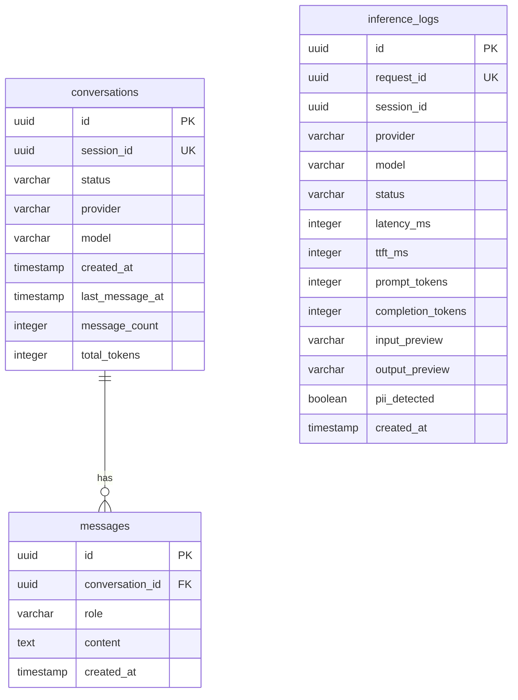

# Ollive LLM Inference Telemetry System

A lightweight, real-time observability, telemetry, and audit logging system for LLM applications. Built with **Express (TypeScript)**, **React + Vite (TypeScript)**, **PostgreSQL (Neon)**, and **Redis (Upstash)**.

---

## 🚀 One-Command Local Startup (Docker Compose)

The entire stack—including PostgreSQL, Redis, the Express Backend, and the React Frontend—can be launched locally in a single command.

### 1. Prerequisites
Ensure you have **Docker** and **Docker Compose** installed on your system.

### 2. Configure Environment Keys
Rename `.env.example` to `.env` in the root folder, and fill in your model API keys:
```bash
cp .env.example .env
```
Open `.env` and configure:
* `GROQ_API_KEY`: Your Groq console API key.
* `GEMINI_API_KEY`: Your Gemini AI Studio API key.
* *(Other environment variables are pre-configured to point to the local Docker containers).*

### 3. Start the Application
Run the following command at the project root:
```bash
docker compose up --build
```

Once building and startup completes:
* **React Web UI**: Access at [http://localhost:5173](http://localhost:5173)
* **Express Backend API**: Access at [http://localhost:4000/health](http://localhost:4000/health)
* **PostgreSQL Database**: Port `5432`
* **Redis Queue Cache**: Port `6379`

---

## 📐 Architecture Overview & Notes

The system is architected as an asynchronous, event-driven, log-ingestion pipeline designed to isolate LLM client latency from ingestion bottlenecks.

```
                  +--------------------------------+
                  |      React Frontend (Vite)     |
                  +---------------+----------------+
                                  |
                   (1) Chat/SSE   |   (2) Telemetry
                      Streams     |       Queries
                                  v
                  +---------------+----------------+
                  |    Express Backend & SDK       |
                  +----+----------------------+----+
                       |                      |
          (3) Call     |                      | (5) Fire-and-forget
            LLM        |                      |     POST /ingest/log
                       v                      v
                +------+------+       +-------+-------+
                | Groq/Gemini |       | Ingest Router |
                +-------------+       +-------+-------+
                                              |
                                              | (6) LPUSH
                                              v
                                      +-------+-------+
                                      |  Redis Queue  |
                                      +-------+-------+
                                              |
                                              | (7) Poll RPOP (Cron)
                                              v
                                      +-------+-------+
                                      | Database/Neon |
                                      +---------------+
```

### 1. Ingestion Flow
1. **Request Wrapping**: The user starts a chat in the React UI. The backend instantiates the `createLLMClient(provider)` adapter, which is wrapped by `withLogging(client, sessionId)`.
2. **Streaming Execution**: As the LLM stream flows, the logging SDK computes the latency and **Time to First Token (TTFT)**.
3. **Log Dispatch**: Upon stream closure, the SDK issues a **non-blocking, fire-and-forget** HTTP POST request to `/ingest/log` before completing the client response.
4. **Queueing**: The Ingestion Router validates the payload against a strict **Zod** schema. If validated, it queues the log in Redis via an atomic `LPUSH` command and returns a `202 Accepted` status within milliseconds.
5. **Draining**: A polling cron job worker (scheduled every 10–60s) retrieves up to 50 queued logs using a thread-safe `RPOP` command loop, runs deduplication checks, and batches them into Postgres via a single bulk insert transaction.

### 2. Logging Strategy
Logs store metadata, parameters, and sanitized previews of user inputs and outputs.
* **PII Redaction**: Previews are scanned for Email, Phone Numbers, Credit Cards, and SSN formats using regexes at the SDK layer. Found patterns are replaced with `[EMAIL]`, `[PHONE]`, `[CARD]`, and `[SSN]`, and the `piiDetected` flag is enabled.
* **Error Telemetry**: If the adapter encounters an exception, it registers a log with `status: 'error'`, maps the runtime error message, and pushes it to the ingestion queue.

### 3. Scaling Considerations
* **DB Isolation**: Logging never holds database locks during chat generation. Redis acts as a buffer to handle peak request spikes.
* **Worker Batching**: Draining queue entries and running a multi-row parameterized `INSERT ... ON CONFLICT DO NOTHING` query significantly reduces Postgres transactions, making it compatible with high-throughput loads.

### 4. Failure Handling Assumptions
* **LLM Auto-Retry**: The SDK client retries request attempts up to 3 times with exponential backoff (`delay = 2^attempt * 1000ms + jitter`) if the APIs throw rate limits (429) or server errors (503).
* **Provider Fallback**: If Groq returns consecutive rate-limit (429) errors, the client falls back to Gemini (`gemini-2.0-flash`) seamlessly, tags the log with the correct provider info, and completes the request.
* **Worker Idempotency**: Logs feature a unique `request_id` (UUID). Under network partitions, if the worker retries batch transactions, Postgres resolves duplicate request insertions gracefully using `ON CONFLICT (request_id) DO NOTHING`.

---

## 🗄️ Database Schema Design (PostgreSQL)

The database schema utilizes three relational tables to maintain conversations, chats, and telemetry:



### Schema Indexes
* `inference_logs(session_id, created_at DESC)`: Speeds up session analysis queries.
* `inference_logs(provider, created_at DESC)`: Optimizes dashboard real-time statistics queries.
* `conversations(last_message_at DESC)`: Speeds up sorting conversation history listings in the UI sidebar.

---

## ⚖️ Tradeoffs & Design Decisions

1. **Redis RPOP Loop vs. LTRIM**:
   * *Decision*: Used an atomic `RPOP` loop to retrieve logs rather than an `LRANGE 0 49` followed by `LTRIM 50 -1`.
   * *Tradeoff*: While `RPOP` loop does multiple fast calls to Redis, it completely avoids index shifting race conditions where concurrent `LPUSH` logs might accidentally get deleted during the `LTRIM` execution.
2. **Postgres for Time Series**:
   * *Decision*: Leveraged standard PostgreSQL with indexes on `(provider, created_at DESC)` instead of complex Time Series databases (like TimescaleDB).
   * *Tradeoff*: Plain Postgres keeps the free-tier setup simple and runs aggregations quickly enough for low-to-medium volume deployments using `DATE_TRUNC`.
3. **Regex PII Redaction at SDK Level**:
   * *Decision*: Scan and redact previews *before* they leave the SDK wrapper to reach the Express server.
   * *Tradeoff*: Although this consumes minor runtime CPU on the app node, it ensures PII data never crosses the network or resides in intermediate queues (Zero Trust).

---

## ☸️ Self-Hosted Kubernetes Deployment

Manifest files are provided under the `k8s/` folder.

To deploy the entire system on a Kubernetes cluster:
```bash
# 1. Apply database and redis stateful deployments
kubectl apply -f k8s/postgres.yaml
kubectl apply -f k8s/redis.yaml

# 2. Configure secret values (optional, edit API keys in k8s/backend.yaml)
# 3. Apply API Backend and React Frontend
kubectl apply -f k8s/backend.yaml
kubectl apply -f k8s/frontend.yaml
```

* Access the frontend locally using NodePort: `http://<NodeIP>:30080`.

---

## 🔮 What I Would Improve With More Time

1. **Redis Streams & Consumer Groups**: Replace the simple Redis `RPOP` polling cron worker with Redis Streams to guarantee at-least-once delivery, support multiple worker replicas, and support Dead Letter Queues (DLQ).
2. **TimescaleDB Integration**: Adapt the Postgres container to use TimescaleDB hypertables for partition management and faster time-series bucket queries.
3. **Advanced PII Filtering**: Integrate Microsoft Presidio or a specialized transformer model (e.g., HuggingFace NER) inside the ingestion pipeline for higher-accuracy PII detection beyond standard regexes.
4. **End-to-End Test Suite**: Add comprehensive mock-based unit tests for LLM providers using MSW and Vitest.
# Assignment1
